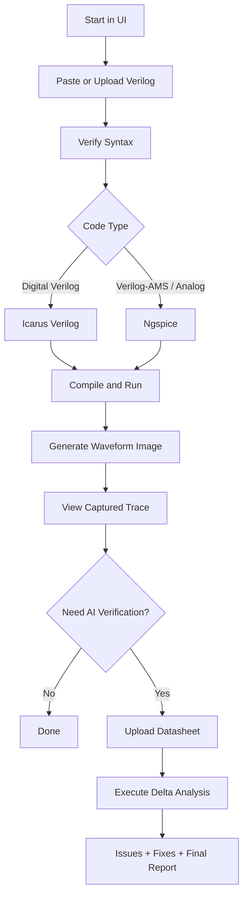

# Verilog Verification Studio

Modern full-stack workflow for Verilog checking, simulation, waveform generation, and AI-assisted iterative verification.

This workspace includes:
- `frontend/`: React + Vite UI
- `backend/`: FastAPI service for syntax checks, compilation, waveform generation, and AI verification
- `verilog/` and sample files for quick testing

## What This Project Does

- Runs **digital Verilog syntax checks** with Icarus Verilog.
- Runs **analog/Verilog-AMS validation and simulation** using Ngspice.
- Generates waveform images for both digital and analog flows.
- Supports AI-driven verification/fix iteration against an uploaded datasheet.
- Auto-selects simulator mode after syntax check:
  - Analog code -> Ngspice
  - Digital code -> Icarus Verilog

## Tech Stack

- Frontend: React + TypeScript + Vite
- Backend: FastAPI + Python
- Simulators:
  - Icarus Verilog (`iverilog`, `vvp`) for digital
  - Ngspice (`ngspice`) for analog/Verilog-AMS path

## Project Structure

```text
.
├── backend/
│   ├── main.py
│   ├── waveform_generator.py
│   ├── verilog_agent.py
│   ├── config.py
│   └── requirements.txt
├── frontend/
│   ├── src/
│   ├── package.json
│   └── vite.config.ts
├── sample_design.v
├── sample_verilog.v
└── verilog/
```

## Prerequisites

- macOS (or Linux) with:
  - Python 3.10+
  - Node.js 18+
  - npm
- Simulators:
  - `ngspice` required for analog flow
  - `iverilog` recommended for digital flow

## macOS Setup

### 1. Install simulators

```bash
/opt/homebrew/bin/brew install ngspice
/opt/homebrew/bin/brew install icarus-verilog
```

If `command -v iverilog` is empty, add Homebrew to PATH:

```bash
echo 'eval "$(/opt/homebrew/bin/brew shellenv)"' >> ~/.zprofile
eval "$(/opt/homebrew/bin/brew shellenv)"
```

### 2. Install backend dependencies

```bash
cd backend
/usr/local/bin/python3 -m pip install -r requirements.txt
```

### 3. Install frontend dependencies

```bash
cd ../frontend
npm install
```

## Environment Variables

Create `backend/.env`:

```env
GOOGLE_API_KEY=your_api_key_here
MAX_ITERATIONS=5
LOG_LEVEL=INFO
```

`GOOGLE_API_KEY` is required for the AI verification step (`/api/verify`).

## Run the App

Open two terminals.

### Terminal A: Backend

```bash
cd backend
/usr/local/bin/python3 -m uvicorn main:app --host 127.0.0.1 --port 8000 --reload
```

### Terminal B: Frontend

```bash
cd frontend
npm run dev
```

Open the URL shown by Vite (usually `http://localhost:5173`).

## API Endpoints

- `GET /api/status`
  - Returns detected simulators (`iverilog`, `ngspice`) and available options.
- `POST /api/syntax`
  - Checks syntax based on selected mode and code type.
- `POST /api/compile`
  - Compiles/simulates and returns waveform image path.
- `POST /api/image?path=...`
  - Serves generated waveform image.
- `POST /api/verify`
  - Runs iterative AI verification (requires datasheet + API key).

## Typical Usage Flow

1. Paste/upload Verilog code.
2. Run **Verify Syntax**.
3. Let UI auto-pick simulator mode.
4. Run **Compile Object** to generate waveform.
5. Open **View Captured Trace**.
6. (Optional) Upload datasheet and run **Execute Delta Analysis**.

## Workflow Flowchart



## Notes on Digital vs Analog

- Digital files (`module`, `always`, etc.) use Icarus Verilog.
- Verilog-AMS/analog (`analog begin`, `electrical`, `<+`) use Ngspice path.
- For digital design-only files without a testbench, backend auto-generates a minimal testbench and VCD trace.

## Troubleshooting

### `ERR_CONNECTION_REFUSED` or `502 Bad Gateway`

- Ensure backend is running on port `8000`.
- Restart frontend dev server after config changes.

### `iverilog` shows false in `/api/status`

- Confirm installation:

```bash
/opt/homebrew/bin/iverilog -V
```

- Ensure PATH includes `/opt/homebrew/bin`.

### Waveform appears empty

- Re-run compile after syntax check.
- Confirm selected simulator matches code type.
- For analog, ensure Ngspice is installed and detected.

### `Execute Delta Analysis` disabled

- Upload a datasheet first (required by backend verify endpoint).

## Security Note

Do not commit real API keys. Keep `backend/.env` local and gitignored.
